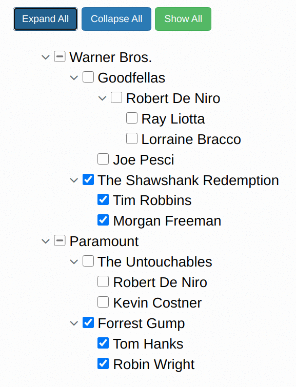

# hummingbird-treeview

A powerful and fast jQuery treeview plugin

#### [View CHANGES.md](https://github.com/hummingbird-dev/hummingbird-treeview/blob/master/CHANGES.md)

## Big Upgrade 2021/06/01

The hummingbird-treeview has been upgraded extensively. If you have used the treeview only
interactively, no changes are needed. However, if you have used it
programatically with respective methods, you have to change your syntax and concept!
  
We now fully support mass assignements, i.e. the methods expect now
arrays of nodes for manipulation. Thus now you can e.g. check many
nodes simultaneously by simply sending an array of id's to the
respective method. The same concept is now valid for all methods.

Under the hood we have a complete new implementation of the tri-state
logic, i.e. setting parent nodes to "indeterminate" if at least one,
but not all children nodes are checked etc. This speeds up the
processing massively and together with the new array concept makes the
treeview super-fast.

The new functionalities allow new useful methods like e.g. *saveState*
and *restoreState*, which can be used to permanently save a treeview
state (remembering of all checked, unchecked, indeterminate
checkboxes) and restore it at any time.

So then, have fun with the new hummingbird-treeview !

<!--
## Demo

#### [https://hummingbird-dev.000webhostapp.com](https://hummingbird-dev.000webhostapp.com).
-->


## Features

- Display hierarchical tree structures.
- Based on simple pseudo HTML lists or full HTML structures.
- Tri-state logic.
- Save and restore full treeview state
- Interactively check, uncheck, collapse, expand.
- Programmatical mass assignments to check, uncheck, collapse, expand, etc.
- Supports disabled nodes, checked or unchecked.
- Get checked/unchecked items programmatically.
- Hide, show, or add and remove nodes dynamically.
- Filter nodes.
- Supports HTML5 data-* attribute to embed custom data.
- Supports Font Awesome icons.
- Search function.
- ... and much more

## Dependencies

- jQuery v3.1.1 
- font-awesome v4.7.0 and font-awesome v5.8.1

The hummingbird-treeview is tested with these versions, other versions work most probably as well.

## Example 




## Getting started


### Installation

Install via npm

``` shell

$ npm i hummingbird-treeview

```

or download manually here on GitHub or integrate via CDNs (see below).


### Usage

Add the following resources for the hummingbird-treeview to function correctly:

```html
	
    <!-- Required Stylesheets -->
    <link href="/path/to/font-awesome.css" rel="stylesheet">
    <link href="/path/to/hummingbird-treeview.min.css" rel="stylesheet">

    <!-- Required Javascript -->
    <script src="/path/to/jquery.js"></script>
    <script src="/path/to/hummingbird-treeview.min.js"></script>

```
Or integrate the resources via CDNs:

### Important: newest release is v3.0.5 !!!

```html
	
    <!-- Required Stylesheets -->
    <link href="https://cdnjs.cloudflare.com/ajax/libs/font-awesome/4.7.0/css/font-awesome.min.css" rel="stylesheet">
    <link href="https://cdn.jsdelivr.net/gh/hummingbird-dev/hummingbird-treeview@v3.0.5/hummingbird-treeview.min.css" rel="stylesheet">

    <!-- Required Javascript -->
    <script src="https://code.jquery.com/jquery-3.4.1.min.js"></script>
    <script src="https://cdn.jsdelivr.net/gh/hummingbird-dev/hummingbird-treeview@v3.0.5/hummingbird-treeview.min.js"></script>

```

or include font-awesome v5.8.1 instead of font-awesome v4.7.0:

```html
	<link rel="stylesheet" href="https://use.fontawesome.com/releases/v5.8.1/css/all.css">
```


The treeview input data can have two different formats, a very simple
pseudo HTML list or a real HTML list structure. The simple pseudo HTML
list can be extended with height and scroll options as well as id and
data-id attributes, thus essentially we have three different ways to
embed the treeview data into the page.

### 1. Simple pseudo HTML

``` html

     <div class="hummingbird-treeview-converter">
        <li>Warner Bros.</li>
        <li>-Goodfellas</li>
        <li>--Robert De Niro</li>
        <li>--Joe Pesci</li>
        <li>-The Shawshank Redemption</li>
        <li>--Tim Robbins</li>
        <li>--Morgan Freeman</li>
        <li>Paramount</li>
        <li>-The Untouchables</li>
        <li>--Robert De Niro</li>
        <li>--Kevin Costner</li>
        <li>-Forrest Gump</li>
        <li>--Tom Hanks</li>
        <li>--Robin Wright</li>
     </div>
	
```

The hyphens indicate the level of indenting. It is important to note
that down the tree the next node can maximal be indented by one level,
i.e. it can only have one hyphen more than the node before (e.g. from
Goodfellas to Robert De Niro). In contrast up the treeview,
arbitrarily large jumps of indention are possible, i.e. the next node
can have much less hyphens than the node before (e.g. from Morgan Freeman to Paramount).

Internally this pseudo HTML list is converted to a real HTML
structure. The treeview is embedded into a ```<div>``` container with
id="treeview_container". The treeview itself is given the
id="treeview". The unique ids of the items/nodes (Warner Bros.,
Goodfellas, ...) follow this schema: id="hum_1", id="hum_2", etc. The
data-ids are given the name of the nodes, i.e. data-id="Warner Bros.",
data-id="Goodfellas", etc. 

Set options, e.g.: (detailed description of all options below)

```javascript

$.fn.hummingbird.defaults.collapsedSymbol = "fa-arrow-circle-o-right";
$.fn.hummingbird.defaults.expandedSymbol = "fa-arrow-circle-o-down";
$.fn.hummingbird.defaults.checkDoubles = true; 
...

```

For using Font-Awesome 5.* add *SymbolPrefix="fas"* or *SymbolPrefix="far"*. Use e.g.

```javascript
$.fn.hummingbird.defaults.SymbolPrefix = "fas";
$.fn.hummingbird.defaults.collapsedSymbol = "fa-hand-point-right";
$.fn.hummingbird.defaults.expandedSymbol = "fa-hand-point-down";
...

```


Initialize hummingbird-treeview within a $(document).ready() block:

```javascript
$(document).ready(function() {

  $("#treeview").hummingbird();

})

```

Congratulations, you are done, your pseudo HTML list has now treeview functionality.

### Multiple treeviews on one page

Using the simple pseudo HTML list with the
*class="hummingbird-treeview-converter"* the id of the treeview will
be automatically set to *"treeview"*. Additional pseudo HTML lists on
the same page will receive the ids *treeview2*, *treeview3*,
etc. Similar to above the unique ids of the items/nodes now follow the
schema: id="hum2_1", id="hum2_2", ... for the second treeview,
id="hum3_1", id="hum3_2", ... for the third treeview, etc. Thus
initialization of every treeview is needed. Options can be set before each initialization.

```javascript

$("#treeview").hummingbird();

$.fn.hummingbird.defaults.checkboxesGroups= "disabled";
$("#treeview2").hummingbird();

$.fn.hummingbird.defaults.checkboxesGroups= "enabled";
$("#treeview3").hummingbird();
...

```


### 2. Simple pseudo HTML plus height, scroll, id, data-id, data-css, data-str, data-nonHoverColor, data-nonHoverColor_bg, data-HoverColor, data-HoverColor_bg

``` html

     <div class="hummingbird-treeview-converter" data-height="100%" 
	 data-scroll="false" data-id="_movies" data-css="overflow-x:scroll; background-color:coral;">
        <li id="item_1" data-id="Studio_1">Warner Bros.</li>
        <li id="item_2" data-id="Movie_1">-Goodfellas</li>
        <li id="item_3" data-id="Actor_1" data-nonHoverColor="#25610b" data-nonHoverColor_bg="yellow" data-HoverColor="red" data-HoverColor_bg="blue">--Robert De Niro</li>
        <li id="item_4" data-id="Actor_2">--Joe Pesci</li>
        <li id="item_5" data-id="Movie_2">-The Shawshank Redemption</li>
        <li id="item_6" data-id="Actor_3">--Tim Robbins</li>
        <li id="item_7" data-id="Actor_4">--Morgan Freeman</li>
        <li id="item_8" data-id="Studio_2">Paramount</li>
        <li id="item_9" data-id="Movie_3" data-str='data-toggle="tooltip" data-placement="auto" title="1987"' >-The Untouchables</li>
        <li id="item_10" data-id="Actor_1">--Robert De Niro</li>
        <li id="item_11" data-id="Actor_5">--Kevin Costner</li>
        <li id="item_12" data-id="Movie_4">-Forrest Gump</li>
        <li id="item_13" data-id="Actor_6">--Tom Hanks</li>
        <li id="item_14" data-id="Actor_7">--Robin Wright</li>
     </div>
	
```

Set the height of the treeview element "relative" with
*data-height="100%"* or "absolute" with *data-height="350px"* and make
it fully scrollable with *data-scroll="true"*. Additionally it is
possible to set custom ids and data-ids. Set a data-id (e.g. to
"_movies") to the div class="hummingbird-treeview-converter" to
address the treeview via the id "treeview_movies". Leave it empty to
use the standard id "treeview".  The example above uses a dynamical
(relative) height and only scolling in x direction.  Add more custom
functionality to the nodes by injecting the "data-str", see node "The
Untouchables" above.  The "data-str" has custom commands enclosed in
single quotes, which can be used e.g. by other JavaScript methods.  In
this example we use Bootstraps tool-tips to show the production year
of the movie in a tool-tip.  Use *data-css* to inject arbitrary CSS,
**except** text colors and background colors. Because those change
dynamically on hover. Therefore use *data-nonHoverColor,
data-nonHoverColor_bg, data-HoverColor, data-HoverColor_bg* as in the
example above with "Robert De Niro". Note that these options don't
work with *hoverMode="bootstrap"*, only with the default hoverMode,
i.e. *hoverMode="html"*


Set options, e.g.: (detailed description of all options below)

```javascript

$.fn.hummingbird.defaults.collapsedSymbol= "fa-arrow-circle-o-right";
$.fn.hummingbird.defaults.expandedSymbol= "fa-arrow-circle-o-down";
$.fn.hummingbird.defaults.checkDoubles= true; 
...

```    

Initialize hummingbird-treeview:

```javascript

$("#treeview_movies").hummingbird();

```

Or if you have left the data-id of the div class="hummingbird-treeview-converter" empty use the standard initialization:

```javascript

$("#treeview").hummingbird();

```


Congratulations, you are done, your pseudo HTML list has now treeview functionality.

### 3. Full HTML structure

Create treeview structure/data:

```html

    <div id="treeview_container" class="hummingbird-treeview" style="height: 230px; overflow-y: scroll;">
    	<ul id="treeview" class="hummingbird-base">
	    <li data-id="0">
		<i class="fa fa-plus"></i>
		<label>
		    <input id="xnode-0" data-id="custom-0" type="checkbox" /> node-0
		</label>
		<ul>
		    <li data-id="1">
			<i class="fa fa-plus"></i>
			<label>
			    <input  id="xnode-0-1" data-id="custom-0-1" type="checkbox" /> node-0-1
			</label>
			<ul>
			    <li>
				<label>
				    <input class="hummingbird-end-node" id="xnode-0-1-1" data-id="custom-0-1-1" type="checkbox" /> node-0-1-1
				</label>
			    </li>
			    <li>
				<label>
				    <input class="hummingbird-end-node" id="xnode-0-1-2" data-id="custom-0-1-2" type="checkbox" /> node-0-1-2
				</label>
			    </li>
			</ul>
		    </li>
		    <li data-id="1">
			<i class="fa fa-plus"></i>
			<label>
			    <input  id="xnode-0-2" data-id="custom-0-2" type="checkbox" /> node-0-2
			</label>
			<ul>
			    <li>
				<label>
				    <input class="hummingbird-end-node" id="xnode-0-2-1" data-id="custom-0-2-1" type="checkbox" /> node-0-2-1
				</label>
			    </li>
			    <li>
				<label>
				    <input class="hummingbird-end-node" id="xnode-0-2-2" data-id="custom-0-2-2" type="checkbox" /> node-0-2-2
				</label>
			    </li>
			</ul>
		    </li>
		</ul>
	    </li>
	</ul>
    </div>

```

Use here exactly the *class="fa fa-plus"* and change Symbols via the options functionality.
The *data-id* of the group `<li>` tags indicates the level or depth of that group. It starts at 0. This is
needed for the option *singleGroupOpen*.

Only change the following:
### Treeview structure and node properties

- **div id**<br>
  The `<div id="treeview_container"` ... can be chosen arbitrarily, but of course must be referred to consistently.
  
- **ul id**<br>
The `<ul id="treeview"` ... can be chosen.

- **ul class="hummingbird-base"**<br>
The base `ul` must be assigned to the "hummingbird-base" class: `<ul id="treeview" class="hummingbird-base">`

- **input id's and data-id's**<br>
  The input id's and data-id's
  e.g. `<input id="xnode-0" data-id="custom-0"` ... can be set. The
  data-id can be any text. 

- **input class="hummingbird-end-node"**<br>
  Add this to every node, which is
  not a parent, i.e. which has no children or nodes below.
  
Do not change the "fa fa-plus", do this via the options (see below).

Change **font-size**, **line-height**, checkbox **width** and
**height** directly in the hummingbird-treeview.css. Additionally, the
**hummingbird-base** class disables line breaks of nodes. To change
that, edit again directly the hummingbird-treeview.css.

## Options
As you have seen above, options can be adjusted by calling

```javascript

$.fn.hummingbird.defaults.option= value;

```

Following options are available:

- **SymbolPrefix**<br> 
  String, set this to "fas" or "far" if you are
  using Font-Awesome 5.*.  Note that the modes "fas" and "far" cannot
  be mixed for the collapsed and expanded symbols. Only one mode for all is supported.

- **collapsedSymbol**<br>
  String, default="fa-plus". This can be any icon
  from the <a href="http://fontawesome.io/icons/">Font Awesome</a> icons.

- **expandedSymbol**<br>
  String, default="fa-minus". This can be any icon
  from the <a href="http://fontawesome.io/icons/">Font Awesome</a> icons.

- **collapseAll**<br>
  Boolean, default=true. On initialization, all
  nodes are collapsed. Change this to false to expand the nodes on initialisation.

- **checkboxes**<br>
  String, default="enabled". Checkboxes are used per
  default. Set this to "disabled" to get a
  treeview without checkboxes.

- **checkboxesGroups**<br> String, default="enabled". Set this to
  "disabled" to disable all checkboxes from nodes that are parents,
  i.e. which have child nodes.  Set this to "disabled_grayed" to also
  apply a "grayed" font color to the node text. Note that disabling
  parent nodes means that they are not clickable, but still provide
  tri-state functionality. Thus, if a child of a disabled parent has
  been checked, the parent node is set to the indeterminate state to
  indicate that a child has been checked.

- **singleGroupOpen**<br> Integer, default=-1. Set this to an integer greater -1 to
  enable the functionality to allow only one group of a defined level to be opened at a time. 
  The number provided defines the level to which the function should be applied (starting at 0).
  For instance, if *singleGroupOpen=0* (which is the typical used level) it means that at level 0 of the tree
  only one group can be opened at a time. As soon as another group of this level is opened, 
  all others will be closed.

- **hoverItems**<br> Boolean, true or false. This option enables a visual mouse hover effect, i.e. on hover on an item the background color
  of this item is changed and also the text color is changed. The default colors for background and text on hover are "#6c757c" and "white".
  And "white" and "black" on non hover.
  
- **hoverColorBg1**<br> This relates to the **hoverItems** option and
  sets the background color on hover, default is "#6c757c". It accepts
  html color names, HEX or RGB (e.g. "rgb(255,0,0)").

- **hoverColorBg2**<br> Same as above for non hover. Default "white".

- **hoverColorText1**<br> Set text color on hover, default is "white".

- **hoverColorText2**<br> Set text color on non hover, default is "black".

- **hoverMode**<br> This options relates as well to the **hoverItems**
	option. Default is the string "html". If this is set to "bootstrap", bootstrap colors can be used. Be
	aware that this only works if you have included the bootstrap
	libraries in your sourcecode. For setting the colors you have to use the option below.
	
- **hoverColorBootstrap**<br>  Default is "bg-secondary text-white". Use any bootstrap color for bg and text.

- **clickGroupsToggle**<br> String, default="disabled". Set this to "enabled"
   to add collapse and expand functionality to a click on a parent node name.


## More data-* attributes

- **data-boldParents="true"**<br>  Changes the font of all parent nodes to bold font.

``` html

     <div class="hummingbird-treeview-converter" data-height="230px" 
	 data-scroll="true" data-id="_movies" data-boldParents="true">
        <li id="item_1" data-id="Studio_1">Warner Bros.</li>
		...
```

- **data-str**<br>  Add custom functionality to a node.

``` html

     <div class="hummingbird-treeview-converter" data-height="230px" 
	 data-scroll="true" data-id="_movies">
        <li id="item_8" data-id="Studio_2">Paramount</li>
        <li id="item_9" data-id="Movie_3" data-str='data-toggle="tooltip" data-placement="auto" title="1987"' >-The Untouchables</li>
        <li id="item_10" data-id="Actor_1">--Robert De Niro</li>
        <li id="item_11" data-id="Actor_5">--Kevin Costner</li>
     </div>

```

Add more custom functionality to the nodes by injecting the "data-str", see node "The Untouchables" above.
The "data-str" has custom commands enclosed in single quotes, which can be used e.g. by other JavaScript methods.
In this example we use Bootstraps tool-tips to show the production year of the movie in a tool-tip.


## Add on options and functionality
Combining different options, methods, events and using additional logic, advanced 
treeview functionalities can be achieve.

- **Pre-check**<br>
  Pre-check some nodes by adding "id's" or "data-id's" to the items, e.g. 
  ```html

		...
        <li data-id="1">--Morgan Freeman</li>
        <li>Paramount</li>
        <li>-The Untouchables</li>
        <li>--Robert De Niro</li>
        <li data-id="2">--Kevin Costner</li>
		...
	
  ```
 Then add the following snippet after treeview initialization:
 
 ```javascript
  
	var pre_check = [1,2];
	$("#treeview").hummingbird("checkNode",{sel:"data-id",vals: pre_check});

	
 ```
 

- **select-single-node**<br> For some applications it makes sense to
  allow only to select one single node. Therefore we first disable
  checking of folders, i.e. parent nodes using the respective option
  before initializing the treeview.  On the *CheckUncheckDone* event
  we uncheck all previously selected nodes, initialize the *List*
  again and get again the checked node. It's important to use the
  *skipCheckUncheckDone* method prior to unchecking, to prevent the
  event to be fired on the unchecking.
  

  
```javascript
$.fn.hummingbird.defaults.checkboxesGroups= "disabled";
$("#treeview").hummingbird();

var List = {"id" : [], "dataid" : [], "text" : []};
$("#treeview").on("CheckUncheckDone", function(){
   //uncheck all previously selected nodes
   if (List.id != "") {
	   $("#treeview").hummingbird("skipCheckUncheckDone");
	   $("#treeview").hummingbird("uncheckNode",{sel:"id",vals:[List.id]});
   }
   //initialize List freshly
   List = {"id" : [], "dataid" : [], "text" : []};
   //get all checked nodes
   $("#treeview").hummingbird("getChecked",{list:List,onlyEndNodes:true});
});

```
  
- **select-single-group**<br>  
  This functionality is in an experimental state, I've tested it not fully, thus please be aware.
  This add on functionality can be used to allow selected nodes only within one group. You can select whole groups or
  nodes within groups, but not end-nodes across groups. The approach is to store all selected nodes in and below the group, where
  the last node was selected. Then uncheck all nodes and following again check all the before stored nodes in that group and below.
  


```javascript
var ListGroup = {"id" : [], "dataid" : [], "text" : []};
var ListGroupOld = {};
var List = {"id" : [], "dataid" : [], "text" : []};

$("#treeview").on("CheckUncheckDone", function(){
   //get all checked nodes below this one
   $("#treeview").hummingbird("getChecked",{list:ListGroup,onlyEndNodes:true,onlyParents:false,fromThis:true});
   //console.log(ListGroup)
   ListGroupOld = ListGroup;

   if (List.id != "") {
	   $("#treeview").hummingbird("skipCheckUncheckDone");
	   $("#treeview").hummingbird("uncheckNode",{sel:"id",vals:[List.id]});
   }
   //initialize List freshly
   List = {"id" : [], "dataid" : [], "text" : []};
   ListGroup = {"id" : [], "dataid" : [], "text" : []};
   //get all checked nodes
   $("#treeview").hummingbird("getChecked",{list:List,onlyEndNodes:true,onlyParents:false,fromThis:false});
   $(document).trigger('reCheckGroup');
});

$(document).on("reCheckGroup", function(){
   //check all from group
   if (ListGroupOld.id != "") {
	   $("#treeview").hummingbird("checkNode",{sel:"id",vals:[ListGroupOld.id]});
   }
});
	

```


## Methods
Methods are used to interact with the treeview programmatically. Following methods are available:

- **checkAll()**<br>
  Checks all nodes including full support for disabled nodes.

```javascript

$("#treeview").hummingbird("checkAll");

```

- **uncheckAll()**<br>
  Unchecks all nodes including full support for disabled nodes.

```javascript

$("#treeview").hummingbird("uncheckAll");

```

- **collapseAll()**<br>
  Collapses all nodes.

```javascript

$("#treeview").hummingbird("collapseAll");

```

- **expandAll()**<br>
  Expands all nodes.

```javascript

$("#treeview").hummingbird("expandAll");

```

- **checkNode(sel, vals)**<br>
  This method checks nodes. *sel* must be either
  "id", "data-id" or "text" to define the selector. 
  *vals* is an array containing the respective nodes.


```javascript

$("#treeview").hummingbird("checkNode",{sel:"id", vals:["hum_1","hum_2","hum_3"]});
$("#treeview").hummingbird("checkNode",{sel:"text", vals:["Goodfellas","Tom Hanks"]});

```

- **uncheckNode(sel, vals)**<br>
  This method unchecks nodes. *sel* must be either
  "id", "data-id" or "text" to define the selector. 
  *vals* is an array containing the respective nodes.

```javascript

$("#treeview").hummingbird("uncheckNode",{sel:"id", vals:["hum_1","hum_2","hum_3"]});
$("#treeview").hummingbird("uncheckNode",{sel:"text", vals:["Goodfellas","Tom Hanks"]});


```

- **expandNode(sel,vals,{expandParents})**<br>
  Expand nodes, which are identified by their
  id's or data-id's, which has to be defined in
  the *sel* parameter. The *vals* array
  holds the names of the id's or data-id's. Set
  optionally expandParents to false, if the
  parents of this node should not be
  expanded. Default of expandParents is
  true.

```javascript

$("#treeview").hummingbird("expandNode",{sel:"id",vals:["hum_5","hum_14"],expandParents:true});

```

- **collapseNode(sel,vals,{collapseChildren})**<br>
  Collapses nodes, which are identified by their
  id's or data-id's, which have to be defined in
  the *sel* parameter. The *vals* array
  holds the names of the id's or data-id's. Set
  optionally collapseChildren to false, if the
  children of this node should not be
  collapsed. Default of collapseChildren is
  true.

```javascript

$("#treeview").hummingbird("collapseNode",{sel:"id",vals:["hum_2","hum_15"],collapseChildren:true});

```

- **disableToggle(attr,name)**<br>
  Disables expand and collapse functionality of nodes, which are identified by their
  id's, data-id's or text which have to be defined in
  the *sel* parameter. The *vals* array
  holds the names of the id's or data-id's. 

```javascript

$("#treeview").hummingbird("disableToggle",{sel:"id",vals:["hum_12","hum_15"]});

```


- **disableNode(sel,vals,state,{disableChildren})**<br> Disables 
  nodes, which are identified by their id's, data-id's or text, which has to be
  defined in the *sel* parameter. The *vals* array holds the names of
  the id's, data-id's or text's.  Set state to true if the nodes should be disabled
  and checked, set it to false if the nodes should be disabled and
  unchecked. Optionally set disableChildren to false or true, default
  is true. 

```javascript

$("#treeview").hummingbird("disableNode",{sel:"id",vals: ["hum_5", "hum_13", "hum_14", "hum_15"],state:false,disableChildren:true});

```

- **enableNode(sel,vals,state,{enableChildren})**<br> Enables 
  former disabled nodes, which are identified by their id's, data-id's or text,
  which has to be defined in the *sel* parameter. The *vals* array
  holds the names of the id's, data-id's, or texts.  Set state to true if the nodes
  should be enabled and checked, set it to false if the nodes should be
  enabled and unchecked. Optionally set enableChildren to false or
  true, default is true. 

```javascript

$("#treeview").hummingbird("enableNode",{sel:"id",vals: ["hum_5", "hum_13", "hum_14", "hum_15"],state:false,enableChildren:true});

```

- **hideNode(sel,vals)**<br> Hide nodes, which are identified by their id's, data-id's or text,
  which has to be defined in the *sel* parameter. The *vals* array
  holds the names of the id's, data-id's, or text. 

```javascript

$("#treeview").hummingbird("hideNode",{sel:"id",vals: ["hum_5","hum_6"]});

```

- **showNode(sel,vals)**<br> Show previously hidden nodes, which are
  identified by their id's, data-id's or text, which has to be defined in
  the *sel* parameter. The *vals* array holds the names of the id's,
  data-id's, or text. 

```javascript

$("#treeview").hummingbird("showNode",{sel:"id",vals: ["hum_5","hum_6"]});

```

- **disableParentNodeOnCollapse(sel,vals,{state})**<br> As long as the
  node is collapsed, it is disabled, and as soon as the node is
  expanded, the node will be enabled. If state=false this function
  will be disabled on that node. Default is state=true.

```javascript

$("#treeview").hummingbird("disableParentNodeOnCollapse",{sel:"id",vals: ["hum_5","hum_6"],state:true});

```


- **addNode(pos,anchor_sel,anchor_vals,text,the_id,data_id,{end_node,children})**<br> All parameters are arrays. Add nodes at pos = 
  ['before','before','after'...] already existing
  nodes. The existing nodes are called here *anchor*. To identify the
  anchor nodes define the *anchor_sel* as id, data-id or text. The 
  parameter *anchor_vals* are then the respective names of the *anchor_sel*. 
  Next define the *text* of the new nodes, the new id's (*the_id*) and the new *data_id's*.
  Note that we use *data-id* with hyphen and *data_id* with underscore. By default a 
  *hummingbird-end-node* is added, i.e. *end_node:true*, shown below. IMPORTANT: The treeview must be initialized again after adding nodes.

```javascript

$("#treeview").hummingbird('addNode',{pos:['after','after'],anchor_sel:['text','id'],anchor_vals:['node-0-1-1-2','hum_5'],
text:['New Node1','New Node2'],the_id:['new_id1','new_id2'],data_id:['new_data_id1','new_data_id2']});

$("#treeview").hummingbird();

```

  If you want to add a node including children, *end_node* must be set to *false* and 
  an array containing children objects must be passed to the method with name *children*:
  In this example we create two new nodes each having two children.


```javascript

var new_children = [
    [
		{id:'n1_child1',data_id:'n1_child1',text:'n1_child1'},
		{id:'n1_child2',data_id:'n1_child2',text:'n1_child2'},
    ],
    [
		{id:'n2_child1',data_id:'n2_child1',text:'n2_child1'},
		{id:'n2_child2',data_id:'n2_child2',text:'n2_child2'},			 
    ]
];

$("#treeview").hummingbird('addNode',{pos:["before","after"],anchor_sel:["text","text"],anchor_vals:["Goodfellas","Paramount"],text:["new_node_1","new_node_2"],the_id:["new_node_1","new_node_2"],data_id:["new_node_1","new_node_2"],end_node:false,children:new_children});

$("#treeview").hummingbird();

```
<!--   Finally it is important to initialise the treeview again after adding nodes. -->
<!--   In the case you want to add a parent node, which contains again parent nodes,  -->
<!--   create first the parent node with a *hummingbird-end-node* child as above. Then -->
<!--   add the next parent to the created *hummingbird-end-node* and finally remove the  -->
<!--   *hummingbird-end-node* node: -->
  
<!-- ```javascript -->

<!-- var children = { -->
<!--    child1: {id:'child1',data_id:'child1',text:'child1'}, -->
<!-- }; -->

<!-- $("#treeview").hummingbird('addNode',{pos:'before',anchor_attr:'text',anchor_name:'Joe Pesci', -->
<!-- text:'Ray Liotta',the_id:'Ray',data_id:'Ray',end_node:false,children:children}); -->

<!-- $("#treeview").hummingbird(); -->

<!-- var children = { -->
<!--    child2: {id:'child2',data_id:'child2',text:'child2'}, -->
<!--    child3: {id:'child3',data_id:'child3',text:'child3'}, -->
<!-- }; -->
		 
<!-- $("#treeview").hummingbird('addNode',{pos:'after',anchor_attr:'text',anchor_name:'child1', -->
<!-- text:'child1',the_id:'child1x',data_id:'child1x',end_node:false,children}); -->
		 
<!-- $("#treeview").hummingbird(); -->

<!-- $("#treeview").hummingbird('removeNode',{attr:'id',name:'child1'}); -->

<!-- $("#treeview").hummingbird(); -->

<!-- ``` -->
    
  Warning: Be careful by using URL query parameters, cookies, 
  or form inputs to create nodes, because this can introduce cross-site-scripting (XSS) 
  vulnerabilities. Remove or escape any user input before adding content to the document. 
 
 
- **removeNode(sel,vals)**<br> Remove a node, which is identified by 
   *sel* equal id, data-id, or text. 
   

```javascript

$("#treeview").hummingbird('removeNode',{attr:'id',name:'node-0-1-1-2'});

$("#treeview").hummingbird();

```

- **getChecked(List,{onlyEndNodes,onlyParents,fromThis})**<br>
  Get checked
  nodes. Retrieve the id, data-id and text of the nodes.
  Set onlyEndNodes to true if you want to retrieve only
  that nodes identified by class="hummingbird-end-node", i.e. those
  nodes without children, so to speak the last instance. Default is
  false, which means that all checked nodes are retrieved. Set onlyParents to true ( and onlyEndNodes to false)
  to get only parents nodes. Set *fromThis* to true to only retrieve nodes from the current group and below (default is false).
  Define an
  object, List, for the output of this method. It is important to name 
  the arrays exactly like in the example below.
  Finally this List
  array can be bound to a DOM element and it is also straight forward
  to do other stuff with the arrays, e.g. retrieving the length of it.

```javascript

var List = {"id" : [], "dataid" : [], "text" : []};
$("#treeview").hummingbird("getChecked",{list:List,onlyEndNodes:true,onlyParents:false,fromThis:false});
$("#displayItems").html(List.text.join("<br>"));
var L = List.id.length;

```

- **getUnchecked(List,{onlyEndNodes,onlyParents})**<br>
  Get unchecked
  nodes. Retrieve the id, data-id and text of the nodes.
  Set onlyEndNodes to true if you want to retrieve only
  that nodes identified by class="hummingbird-end-node", i.e. those
  nodes without children, so to speak the last instance. Default is
  false, which means that all unchecked nodes are retrieved. Set onlyParents to true ( and onlyEndNodes to false)
  to get only parents nodes.
    Define an
  object, List, for the output of this method. It is important to name 
  the arrays exactly like in the example below.
  Finally this List
  array can be bound to a DOM element and it is also straight forward
  to do other stuff with the arrays, e.g. retrieving the length of it.

```javascript

var List = {"id" : [], "dataid" : [], "text" : []};
$("#treeview").hummingbird("getUnchecked",{list:List,onlyEndNodes:true,onlyParents:false});
$("#displayItems").html(List.text.join("<br>"));
var L = List.id.length;

```

- **getIndeterminate(List)**<br>
  Get indeterminate
  nodes. Retrieve the id, data-id and text of the nodes.
  Define an
  object, List, for the output of this method. It is important to name 
  the arrays exactly like in the example below.
  Finally this List
  array can be bound to a DOM element and it is also straight forward
  to do other stuff with the arrays, e.g. retrieving the length of it.

```javascript

var List = {"id" : [], "dataid" : [], "text" : []};
$("#treeview").hummingbird("getIndeterminate",{list:List});
$("#displayItems").html(List.text.join("<br>"));
var L = List.id.length;

```

- **saveState(treeState)**<br> A typically occuring situation is that
    it is needed to save the state of the treeview for later
    rebuilding.  This can be accomplished by using the *saveState* and
    *restoreState* methods.  First save the state in the object
    *treeState* and restore it later. A good point for saving the
    state is after receiving the *CheckUncheckDone* event. 


```javascript

var treeState = {};
$("#treeview").hummingbird("saveState",{save_state:treeState});

```

- **restoreState(treeState)**<br> Restore the before saved state from the object *treeState*.

```javascript

$("#treeview").hummingbird("restoreState",{restore_state:treeState});

```
   <br>
   In addition *restoreState* can be used to create any arbitrary states created by custom methods.
   Therefore the *treeState* object must look like the following:
  
```javascript

var treeState = {"checked":{}, "indeterminate":{}};
treeState.checked = checked;
treeState.indeterminate = indeterminate;

```
   <br>
   where the objects *checked* and *indeterminate* contain the respective node ID information:

```javascript

var checked = {"id" : []};
var indeterminate = {"id" : []};

```

- **triState**<br> This is the function, which controls the tri-state
  functionality. Use it if you have changed the treeview by external procedures to achieve a consistent tri-state.

```javascript

$("#treeview").hummingbird("triState");

```

- **skipCheckUncheckDone**<br> Skip firing the *CheckUncheckDone* event in the following call.
  This method can be called before any other method to skip firing the *CheckUncheckDone* event in the followed method.

```javascript

$("#treeview").hummingbird("skipCheckUncheckDone");

```

- **filter(str,{box_disable,caseSensitive,onlyEndNodes,filterChildren})**<br>
  Removes all nodes which NOT match a search pattern.
  Use "|" as a seperator of search strings.
  The *filter* method uses the *OR* logic. For instance if *str=".txt|.jpg|test"*
  then only nodes which contain
  *.txt* or *.jpg* or *test* are shown in the treeview.
  Optional setting:<br> 
  Use *box_disable: true* to not remove the nodes, but disable them.
  Use *caseSensitive: true* to restrict searches to exact case-match, the deafult filter criteria is case-insensitive.
  To apply the filter only to nodes, which have no children, i.e. those of class="hummingbird-end-node" use
  *onlyEndNodes:true*. 
   Set *filterChildren:false*
  to NOT remove children of a node that is not filtered out.

```javascript

$("#treeview").hummingbird("filter",{str:".txt|.jpg|test", caseSensitive: false, box_disable:false, onlyEndNodes:false, filterChildren:true});

```

- **search(treeview_container,search_input,search_output,search_button,{scrollOffset, onlyEndNodes, dialog, EnterKey, enter_key_1, enter_key_2})**<br>
  If the treeview is embedded in a
  scrollable (css option: overflow-y:
  scroll;) container, this container must be
  identified here as the treeview_container
  (using the id). Otherwise
  treeview_container should be set to
  "body". The search_input parameter depicts
  the id of the input element for the search
  function. The search_output defines an
  element to bind the search results on
  (like the ul in the example below). The search_button is
  simply the button for the search. A
  scrollOffset in pixels (negative or
  positive) can be defined to adjust the
  automatic scoll position. The best value
  must be observed by
  testing. onlyEndNodes is per default
  false, thus set this to true if the search
  should include also parent nodes. The
  optional parameter dialog is per default
  empty (""). This parameter can be used for
  special cases, to bind the treeview to a
  dynamical created object like a bootstrap
  modal (pop-up). In such a case this
  parameter would be
  dialog:".modal-dialog". Three other
  optional parameters, EnterKey, enter_key_1
  and enter_key_2 are available. EnterKey is
  per default true and can be set to
  false. If true the search_button can be
  triggered with the Enter key. To avoid
  interference of the Enter key
  functionality it can be restricted and
  only be executable if enter_key_1 ==
  enter_key_2. These two parameters can be
  chosen arbitrarily.

```javascript

$("#treeview").hummingbird("search",{treeview_container:"treeview_container", search_input:"search_input", search_output:"search_output", search_button:"search_button", scrollOffset:-515, onlyEndNodes:false});

```

  As an example, the search functionality is here
  implemented using <a href="http://getbootstrap.com/">Bootstrap</a>. Other implementation are possible.

  HTML:
  
```html

<div class="dropdown">
    <div class="input-group stylish-input-group">
	<input id="search_input" type="text" class="form-control" placeholder="Search" onclick="this.select()">
	<span class="input-group-addon" style="border-left:0">
	    <button type="submit" id="search_button">
		<span class="glyphicon glyphicon-search"></span>
	    </button>
	</span>
	<ul class="dropdown-menu h-scroll" id="search_output">
	</ul>
    </div>
</div>

```

  CSS:

```css

.stylish-input-group .input-group-addon{
    background: white !important;
}
.stylish-input-group .form-control{
    //border-right:0;
    box-shadow:0 0 0;
    border-color:#ccc;
}
.stylish-input-group button{
    border:0;
    background:transparent;
}

.h-scroll {
    background-color: #fcfdfd;
    height: 260px; 
    overflow-y: scroll;
}

```


## Events
Events are fired on changes of the treeview state so that your application can respond:

- **nodeChecked**<br>
  This event is fired if a node has been checked and can be catched like this:

```javascript

$("#treeview").on("nodeChecked", function(){
   do something ...
});

```

- **nodeUnchecked**<br>
  This event is fired if a node has been unchecked and can be catched like this:

```javascript

$("#treeview").on("nodeUnchecked", function(){
   do something ...
});

```


- **CheckUncheckDone**<br>
  This event is fired if a node has been
  checked or unchecked and all treeview
  functionality is completed. This comprises
  checking / unchecking parents, children,
  checking for n-tuples and disabled etc.

```javascript

$("#treeview").on("CheckUncheckDone", function(){
   do something ...
});

```


- **nodeCollapsed**<br>
  This event is fired if a parent node has been collapsed and can be catched like this:

```javascript

$("#treeview").on("nodeCollapsed", function(){
   do something ...
});

```


- **nodeExpanded**<br>
  This event is fired if a parent node has been expanded and can be catched like this:

```javascript

$("#treeview").on("nodeExpanded", function(){
   do something ...
});

```
